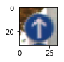
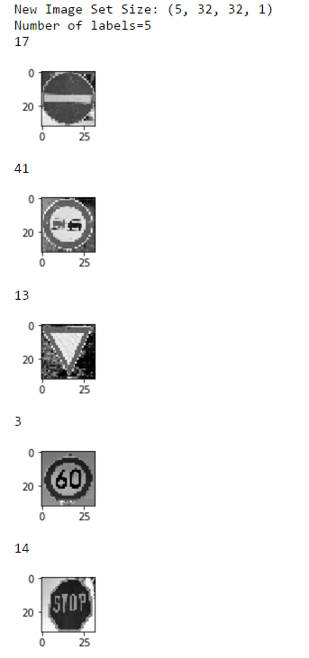

#Traffic Sign Recognition

Build a Traffic Sign Recognition Project

The goals / steps of this project are the following:

1. Load the data set (see below for links to the project data set)
2. Explore, summarize and visualize the data set
3. Design, train and test a model architecture
4. Use the model to make predictions on new images
5. Analyze the softmax probabilities of the new images
6. Summarize the results with a written report
7. Rubric Points

####1. Provide a basic summary of the data set and identify where in your code the summary was done. In the code, the analysis should be done using python, numpy and/or pandas methods rather than hardcoding results manually.

The code for this step is contained in the second code cell of the Jupyter notebook.

I used the numpy library to calculate summary statistics of the traffic signs data set:

Number of training examples = 34799
Number of testing examples = 12630
Image data shape = (32, 32, 3)
Number of classes = 43
####2. Include an exploratory visualization of the dataset and identify where the code is in your code file.

The code for this step is contained in the third code cell of the IPython notebook.

Here is an exploratory visualization of the data set. It is a print out of one of the elements in the training set prior to pre-processing.

###Design and Test a Model Architecture

####1. Describe how, and identify where in your code, you preprocessed the image data. What tecniques were chosen and why did you choose these techniques? Consider including images showing the output of each preprocessing technique. Pre-processing refers to techniques such as converting to grayscale, normalization, etc.

I took the following steps for pre-processing:

1. Using cv2, turn the image grayscale
2. Normalize the grayscaled image by the operation `normalized_grey_img = grey_img / 255. - 0.5`
3. Using `np.expand_dims()`, expand the the dimensions of the images to three dimensions.
4. Shuffle the training set to avoid overfitting.

####2. Describe how, and identify where in your code, you set up training, validation and testing data. How much data was in each set? Explain what techniques were used to split the data into these sets. (OPTIONAL: As described in the "Stand Out Suggestions" part of the rubric, if you generated additional data for training, describe why you decided to generate additional data, how you generated the data, identify where in your code, and provide example images of the additional data)

Each of the data sets were pulled from the provided pickled data using pickle. The training set contained 34799 example images to classify by the neural network. The set also included a set for validation to confirm the accuracy of the network.

Finally, it also included a set of 12630 images to test the neural network against unfamiliar images.

####3. Describe, and identify where in your code, what your final model architecture looks like including model type, layers, layer sizes, connectivity, etc.) Consider including a diagram and/or table describing the final model.

My final model consisted of the following layers. The network structure was introduced by the LeNet lab:

1. 5x5 convolutional layer with an output depth of 6
2. Relu
3. Max pool with (1, 2, 2, 1)
4. 5x5 convolutional layer with an output depth of 16
5. Relu
6. Max pool with (1, 2, 2, 1)
7. Flatten data
8. Fully connected layer 400 -> 120
9. Fully connected layer 120 -> 84
10. Fully connected layer 84 -> 43
11. Softmax

####4. Describe how, and identify where in your code, you trained your model. The discussion can include the type of optimizer, the batch size, number of epochs and any hyperparameters such as learning rate.

The majority of hyper parameters can be found defined in the following set of constants:

`
# Constants
EPOCHS = 75
BATCH_SIZE = 128
NORMALIZED_MEAN = 0
NORMALIZED_ST_DEV = 0.1
NUM_LABELS = 43
NUM_FULLY_CONNECTED_NODES = 120
NUM_FULLY_CONNECTED2_NODES = 84
LEARNING_RATE = 0.006
`

This was to make it easier to tune the network during testing. The set of code of defining the way the network was tested can be found in the code snippit below. The suggestion was again taken from LeNet and used an Adam Optimizer.

`
# Calculate logits and setup optimizer
logits = TrafficSignClassifier(x)
cross_entropy = tf.nn.softmax_cross_entropy_with_logits(labels=one_hot_y, logits=logits)
loss_operation = tf.reduce_mean(cross_entropy)
optimizer = tf.train.AdamOptimizer(learning_rate=LEARNING_RATE)
training_operation = optimizer.minimize(loss_operation)
`

####5. Describe the approach taken for finding a solution. Include in the discussion the results on the training, validation and test sets and where in the code these were calculated. Your approach may have been an iterative process, in which case, outline the steps you took to get to the final solution and why you chose those steps. Perhaps your solution involved an already well known implementation or architecture. In this case, discuss why you think the architecture is suitable for the current problem.

The code for calculating the accuracy of the model is located in the ninth cell of the Ipython notebook.

My final model results were:

training set accuracy of ~ 92-94%
validation set accuracy of ~ 92-94%
test set accuracy of ~92-94%

* I began with the LeNet architecture and decided to continue with it for the duration of the project. I was pretty confident in the performance of the architecture when the network was outputting results in the mid-high 80s prior to me adding any pre-processing logic to the architecture.
* I ran into a bit of a struggle with getting the system to accept the single depth grayscale images during development. Eventually, with the help of forum moderators, I was able to complete training by using numpy's extend_dimension() method.
* I tried adding layers to the network but any addition resulted in compilation errors or 
* I played around with hyper parameters to see what parameters were making the largest difference on the eventual output. I noticed that increasing the learning rate hit a point of diminishing returns around .009. I also increased the epochs to decrease the amount of variance across training sessions. Finally, I also updated the code to change 
* The key aspect I learned on this project was about how additional convolutional layers will pick up finer and finer details in the image compared to the previous layer. This became essential in distinguishing several similar looking signs.

###Test a Model on New Images

####1. Choose five German traffic signs found on the web and provide them in the report. For each image, discuss what quality or qualities might be difficult to classify.

Here are five German traffic signs that I found on the web:

####2. Discuss the model's predictions on these new traffic signs and compare the results to predicting on the test set. Identify where in your code predictions were made. At a minimum, discuss what the predictions were, the accuracy on these new predictions, and compare the accuracy to the accuracy on the test set (OPTIONAL: Discuss the results in more detail as described in the "Stand Out Suggestions" part of the rubric).

The code for making predictions on my final model is located in the tenth cell of the Ipython notebook.

Here are the results of the prediction:

Image	    Prediction
60 km/h     60 km/h
No Passing  No passing for vehicles over 3.5 metric tons
Stop        Stop
No Enter    No Enter
Yield       Yield

I've consistently have gotten 80% on these set of images. This is comparatively lower than the 92-94% range that I've gotten on the pickled dataset that I got as part of the assignment dataset. However, the fact that the "No Passing" image is failing consistently across test runs leads me to believe that it is either of the following:
1. The image quality is becoming degraded to a point where the neural network cannot distinguish between "No Passing" and "No Passing for vehicles over 3.5 metric tons" very well.
2. The convolutional components of the network is not being able to pick up finer details on the new image.

####3. Describe how certain the model is when predicting on each of the five new images by looking at the softmax probabilities for each prediction and identify where in your code softmax probabilities were outputted. Provide the top 5 softmax probabilities for each image along with the sign type of each probability.

The code for making predictions on my final model is located in the 11th cell of the Ipython notebook.

All values in the softmax output is *very* confident about the system's prediction. This is interesting considering that one of the image (the No Passing image) has been consistently classified incorrectly. I'd like to think that this consistent error is due to how pixelized the image inside the sign is.

Probability	Prediction
1.0	    No Entry
.999	No Passing
.999	Yield
1.0	    Speed limit 60km/h
1.0  	Stop sign

I also think that this high score on these images are due to the high number of epochs during training. In addition, these images have minimal amounts of space around the sign. In the future, I should try testing the system against images with large amounts of spacing.